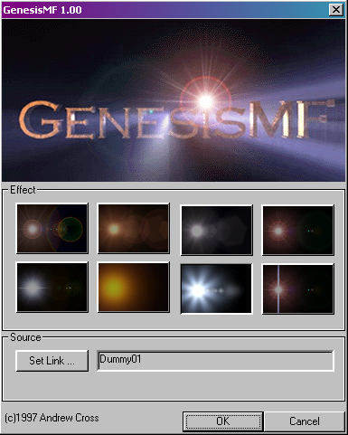
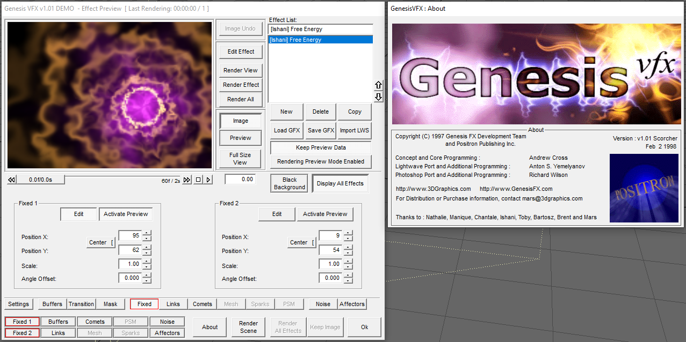
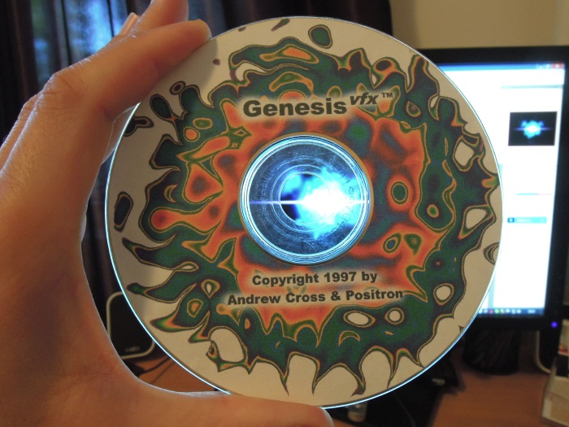

## Original Materials

This folder contains as many of the original Genesis installs, documents and presets as I've found over the many years of tracking bits and pieces down.

Do you happen to have anything we don't? Contact me!

## Common

All the original VFX preset files I can lay my hands on, loadable by any full version.

## 3dsmax

#### GenesisMF - "Mini Flare"

A restricted freeware plugin used to drum up interest in the more feature-complete version; *GenesisMF* is a Video Post plugin that renders one of 8 bundled lens flares at a chosen object position.

## Lightwave

Both original and patched installs that should work with Lightwave 5.0+.

## Photoshop

Version 1 and Version 2 original installers, unpacked versions of both for reference. Original source code snapshot for version 1, of an unknown revision.

## Companion CD

This is an ISO rip from a companion CD that has various demos, presets and other free goodies.

CD unearthed by Ivailo ( https://thedezine.com/)

