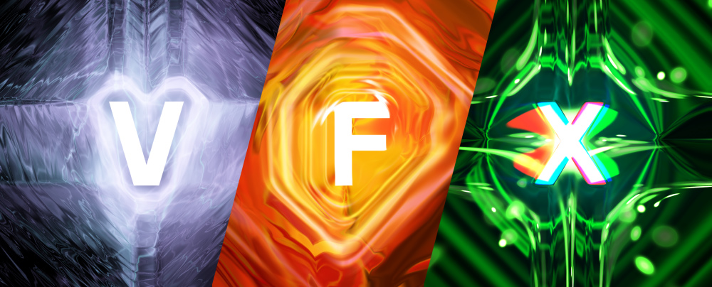
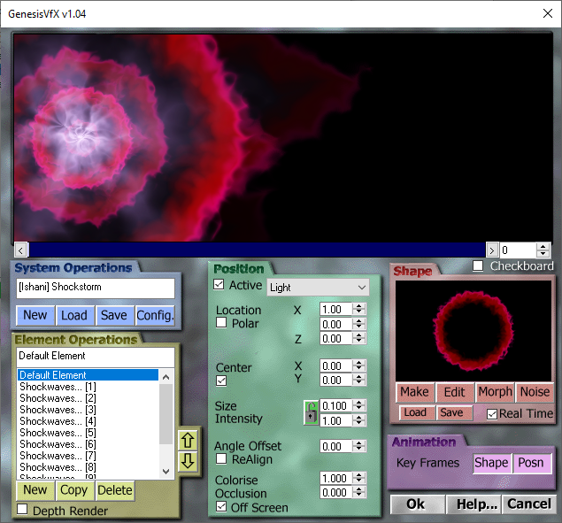
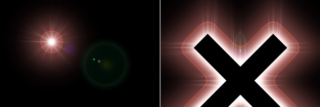
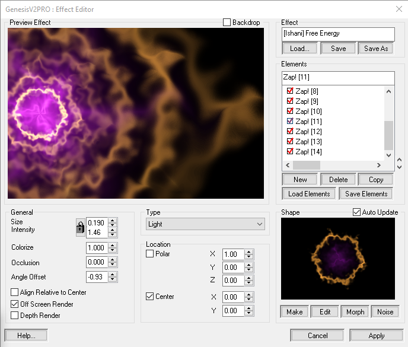
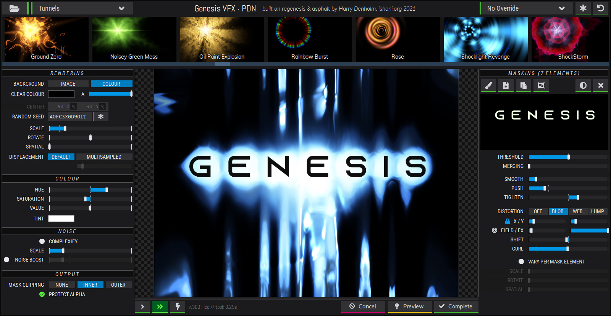

## Contents

This repository contains both an archive of all recovered, original **Genesis VFX** content as well as a from-scratch rewrite of the Genesis rendering engine based on the recovered Photoshop source code - a project called _regenesis_.

 
 

## The Original

Released in 1997, **Genesis VFX** was a flexible, multi-purpose visual effects tool written by Andrew "Deadline" Cross and published by _Future Fantastic_ and _Positron_. It offered a vibrant GUI for creating layered, highly-configurable effects out of procedural, geometric elements, each one with its own unique blending and distortion properties. Presets could be stored in .GFX files and shared with others.

The simplest use would be to make lens flares - and the 90s *loved* lens flares. 

 Dig a bit deeper though and there was a wild world of cool and unusual results possible. The software offered some unique and powerful features not found in anything else at the time; most notable the ability to "wrap" any effect around arbitrary shapes via a masking system, helping to cater to another 90s favourite : *extremely funky text*.

Various versions shipped, integrating into _Photoshop_, _3D Studio MAX_ and _Lightwave 3D_. Various snaphots and collected builds are available in the [Original](/Original) directory.

Check out the original Genesis website via [archive.org](http://web.archive.org/web/19970607235000/http://www.max3d.com/~deadline/Genesis/Index.html)

Later, a **Genesis VFX 2.0 PRO** version shipped with a less *Kai's Power Tools*-inspired UI (boo! more colourful weird GUIs!) plus a small selection of improved features, faster rendering and a more refined preset management system.

 
 

## The Present - *regeneis*

Several years ago I became suddenly re-interested in how Genesis had functioned - specifically the 'wrap' functionality. I reached out to Andrew to see if he could provide any hints but the intervening years had blurred any memories of the original design (and the code was lost to time). 

A lucky break came in late 2017 when I was able to recover the original Photoshop source code - and with Andrew's blessing, began a project to untangle the code and rebuild the engine from scratch for sake of longer-term preservation.

The _regenesis_ core now also powers a modern reimagining as a fully-featured plugin for [Paint.NET](https://www.getpaint.net/) using my bespoke Win Forms UI framework, _asphalt_. It loads all original `.GFX` preset files and exposes some new quirks and tweaks for further experimenting with Genesis' capabilities. 

Optimised, multi-threaded and comprehensively commented, _regenesis_ seeks to keep this wonderful bit of 90s arcana alive and kicking!

  
  

> Photoshop is a registered trademark of Adobe

> 3D Studio MAX and 3ds Max are registered trademarks of Autodesk, Inc.

> Lightwave 3D is a registered trademark of NewTek, Inc.