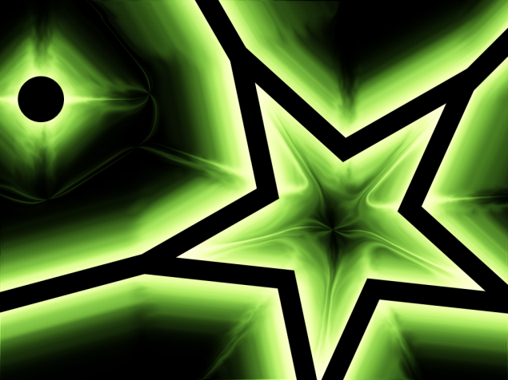
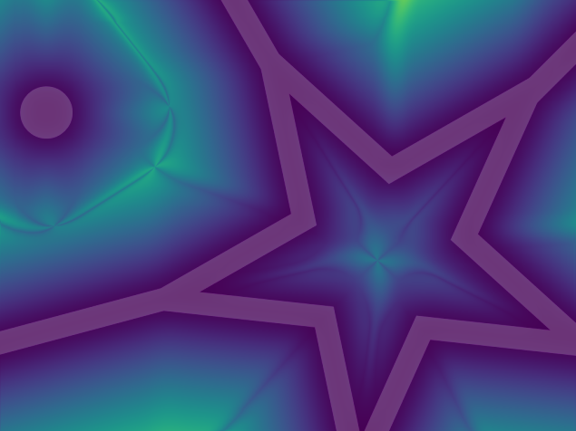

## Contents

This repository contains both an archive of all recovered, original **Genesis VFX** content as well as a from-scratch rewrite of the Genesis rendering engine based on the recovered Photoshop source code - a project called _regenesis_.

 
 

## The Original

Released in 1997, **Genesis VFX** was a flexible, multi-purpose visual effects tool written by Andrew "Deadline" Cross and published by _Future Fantastic_ and _Positron_. It offered a vibrant GUI for creating layered, highly-configurable effects out of procedural, geometric elements, each one with its own unique blending and distortion properties. Presets could be stored in .GFX files and shared with others.

You can still check out the original Genesis website via [archive.org](http://web.archive.org/web/19970607235000/http://www.max3d.com/~deadline/Genesis/Index.html)

The simplest use would appear be to creating lens flares - and the 90s *loved* lens flares.

 Dig a bit deeper though and there was a wild world of cool and unusual results possible. The software offered some unique and powerful features not found in anything else at the time; most notable the ability to "wrap" any effect around any number of arbitrary shapes via a masking system, helping to cater to another 90s favourite : *extremely funky text*.

Various versions shipped, integrating into _Photoshop_, _3D Studio MAX_ and _Lightwave 3D_. Various snaphots and collected builds are available in the [Original](/Original) directory.

Later, a **Genesis VFX 2.0 PRO** version shipped with a less *Kai's Power Tools*-inspired UI (boo! more colourful weird GUIs!) plus a small selection of improved features, faster rendering and a more refined preset management system.

My interest in Genesis stems from my involvement in its early testing and development. Andrew and I crossed paths in the burgeoning 3dsmax plugin development scene and he ended up a source of encouragement and inspiration when it came to my own attempts at visual effects development.

I ended up creating a number of popular preset packs for the product launch as well as offering guidance for the 3dsmax version. In the last decade my personal site has held a small shrine to Genesis, housing any old builds I could find and a short history of the project. I consider all the work on this repo to be (probably) the final form of my obsession with it!

 
 

## The Present - *regenesis*

Several years ago I became suddenly re-interested in how Genesis had functioned - specifically the 'wrap' functionality. I reached out to Andrew to see if he could provide any hints but the intervening years had blurred any memories of the original design (and the code was lost to time).

A lucky break came in late 2017 when I was able to recover the original Photoshop source code - and with Andrew's blessing, began a project to untangle the code and rebuild the engine from scratch for sake of longer-term preservation.

The _regenesis_ core now also powers a modern reimagining as a fully-featured plugin for [Paint.NET](https://www.getpaint.net/) using my bespoke Win Forms UI framework, _asphalt_. It loads all original `.GFX` preset files and exposes some new quirks and tweaks for further experimenting with Genesis' capabilities. 

Optimised, multi-threaded and comprehensively commented, _regenesis_ seeks to keep this wonderful bit of vfx arcana alive and kicking!

Currently a build is available in *releases*, however it is a manual install process (not difficult, but still). An installer will be created in the future to ease setup.

*regenesis* is built with `premake5` and should run on Windows and Linux. A command-line demo is provided to demonstrate standalone rendering.

 
 

## The Guts

Ok, so how *does* the wrap function work?

While porting and refactoring the original core, I added some debug buffer output to help me understand what was going on as the algorithm progressed. The following sequence walks through what goes on in the "Deep Mask" processing path - generating various buffers that finally drive the wrapped-effect rendering.

### **Initial Setup**

We're going to take the `Noisy Green Mess` preset and render it using a mask. By default, it looks a bit like this. 

The mask is a couple of simple shapes - separated to show how the alogrithm deals with multiple competing surfaces:

The end result will look like this:

... So what's happening to get there?

### **Stage 1 - Mask Extraction**

First, the mask image is analysed in a multi-pass process to extract a list of how many separate mask elements exist and which pixels belong to each element. While this is happening, a centroid is computed for each element as an average of the contributing pixel positions.

This sequence shows each pass across the image as it discovers and then flood-fills the larger star shape element. The arrows show the progression of the computed centroid as the balance of pixels changes.

The fill phase finds the first unaccounted-for pixel in the mask and then expands out in a diagonal direction (flipping diagonal direction on each pass) in multiple passes until it has accounted for all connected pixels in the shape.

### **Stage 2 - Unsigned Distance Field (UDF)**

Once the mask elements are built, the next step is to compute how far each pixel in the image is away from the nearest element edge. 

To do this, Genesis first seeds a buffer with two values - if a pixel is inside the mask element, it gets a large value, otherwise 0.

Then, we sweep multiple times across this buffer in different directions, 'smearing' outwards from the masked areas, only updating a pixel if the distance value increases.

To soften the hard edges, the distance field is then smoothed using a separable Gaussian blur with a configurable radius.

### **Stage 3 - Distance Gradient Field**

Next, we compute the gradient of the distance field. This is a vector field that points in the direction of the nearest element edge. This is achieved using a [Sobel operator](https://en.wikipedia.org/wiki/Sobel_operator) on the UDF to estimate the direction from local distance changes. This is then integrated with the original distance value.

This buffer is a little harder to visualise. The first image shows a representation of 2D direction in the R/B colour channels. The second image shows the magnitude of the gradient using a Viridis gradient palette.

### **Stage 4 - Final Rendering**

Finally, the rendering loop shifts in presence of the mask buffer data. Instead of a flare being rendered around a single central point on the image, each pixel recomputes the internal rendering structures to place the center of the flare at the nearest element edge.

The distance gradient field is used to offset the current pixel towards the nearest edge; the flare renderer is effectively "reset" to consider this the new center and rendering proceeds. This results in the flare being effectively warped to fit the distance field.

  
  

> Photoshop is a registered trademark of Adobe

> 3D Studio MAX and 3ds Max are registered trademarks of Autodesk, Inc.

> Lightwave 3D is a registered trademark of NewTek, Inc.