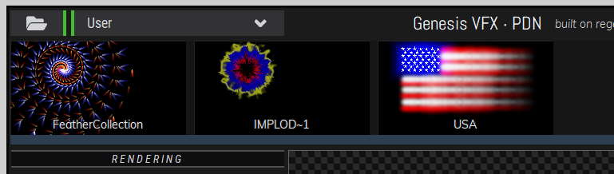

## Genesis VFX for Paint.NET
#### built on regenesis & asphalt by Harry Denholm, ishani.org 2021

https://github.com/ishani/GenesisVFX

### Requirements

* [Paint.NET](https://www.getpaint.net/) 4.2 or higher (tested in 4.2 and 4.3)
* The plugin UI requires a resolution of at least 1600x1000

 
 

This is a manual installation of the Genesis VFX plugin for Paint.NET.

## Step 1

Copy the contents of `\Effects` into `C:\Program Files\paint.net\Effects`

* `\Effects\GenesisVFX.Asphalt.Controls.dll`
* `\Effects\GenesisVFX.Asphalt.Fonts.dll`
* `\Effects\GenesisVFX.Asphalt.PDN.dll`
* `\Effects\GenesisVFX.dll`
* `\Effects\GenesisVFX.Runtime\Regenesis64.dll`

This is the UI libraries (*asphalt*), the Paint.NET plugin (*GenesisVFX.dll*) and the *regenesis* rendering engine runtime.

If the rendering runtime is missing, you will be told upon startup

 

If the runtime cannot load, it will cause an exception

.. this is most likely due to missing Visual Studio runtime libraries. You can download an installer from Microsoft [here](https://aka.ms/vs/17/release/vc_redist.x64.exe) (from [reference](https://docs.microsoft.com/en-US/cpp/windows/latest-supported-vc-redist?view=msvc-170))

 

## Step 2

Genesis VFX loads preset collections from a zip file; we provide a great selection of examples in the `\Library` folder. Copy `regenesis-library.zip` somewhere .. such as your *Documents* folder, or somewhere you'll know where to find it.

 

## Step 3

Run Paint.NET; access **Genesis VFX** from the **Effects / Render** menu

Initially, you'll have no preset zip loaded - select one using the top-left load button

.. and go find where you copied the `regenesis-library.zip` file. 

Browse and select presets from the collection; note that if you are rendering onto a white background, you may not be able to see many effects as they are designed to be additive. Switch to a solid background colour or load an image first.

If the live preview window is sluggish, try selecting a lower-resolution preview with the right-most (lightning bolt icon) button under the viewport.

Note: most buttons have tooltips to help!

Once happy, click **Complete** to render the result back to Paint.NET - or **Cancel** to abort.

 

## Note

To load custom loose preset .GFX files, place them in the user files folder

`C:\Users\<Username>\Documents\paint.net User Files\GenesisVFX\`

.. and they will appear in a special **User** folder in Genesis VFX

If you want to create .GFX files you will need to use the original Genesis VFX plugin - ensure you save in the 1.00 file format if you're using *Genesis VFX 2 Pro* to do so.

 
 

## Note - Optional Optimizations

If you have a reasonably recent CPU, you can try the more intensively optimised rendering runtime. Copy the contents of the `Optional-ICC\GenesisVFX.Runtime` directory into `C:\Program Files\paint.net\Effects\GenesisVFX.Runtime` overwriting the contents.

